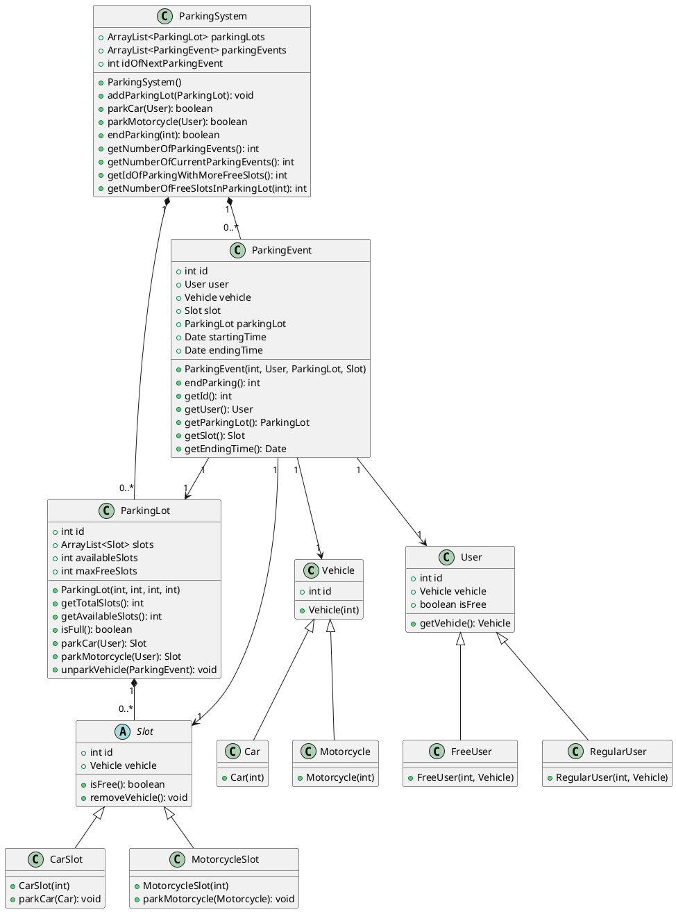

# Parking Lot System

Implementation of a parking lot system using the provided UML diagram.

# UML

   
## PlantUML code:

## Funcionamiento
Es prohíbido el uso de cualquier tipo de material de consulta, incluyendo libros, apuntes, internet, etc. El trabajo es individual y cualquier intento de copia o fraude será penalizado. No se permite el uso de asistentes de programación como COPILOT o chatGPT. Cualquier duda o aclaración, por favor preguntar al profesor.   
   
Los casos de prueba no pueden ser editados, ni se pueden agregar o quitar casos de prueba. Si se hace, el parcial será anulado y se considerará como copia. Si hay algún error en los casos de prueba, por favor notificar al profesor.

